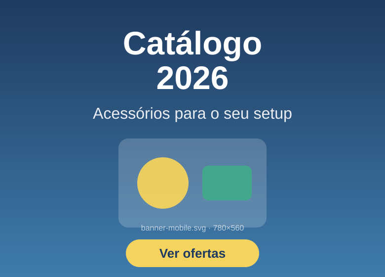

# Catálogo Responsivo — CSS Grid

Atividade **03 - Responsivo - GRID CSS** do curso de Bacharelado em Sistemas de Informação
(Centro Universitário para o Desenvolvimento do Alto Vale do Itajaí — UNIDAVI).

- **Disciplina:** Desenvolvimento para Plataformas Móveis
- **Professor:** Sandro Alencar Fernandes
- **Aluno:** Johann Malkowski

Website responsivo de catálogo construído com **HTML + CSS**, usando **CSS Grid** para todo o
layout de página, a partir do wireframe do Figma
[`Catalogo_Responsivo`](https://www.figma.com/design/klRQfxzaVso7rn3q3oIbFE/Catalogo_Responsivo?node-id=0-1).

## Como abrir

Basta abrir o `index.html` no navegador — não há dependências nem etapa de build.

Para servir por HTTP (recomendado, evita restrições de `file://`):

```bash
python -m http.server 8000
# depois acesse http://localhost:8000
```

## Estrutura

```
.
├── index.html          # marcação semântica da página
├── css/style.css       # layout em CSS Grid, mobile first
├── js/menu.js          # abre/fecha o menu hambúrguer
├── js/busca.js         # filtra os produtos pelo campo de busca
└── img/                # logo, banners e imagens dos produtos (SVG)
```

## Requisitos da atividade

| Requisito | Onde está |
| --- | --- |
| Layout com CSS Grid | `body`, `.cabecalho`, `.grade-produtos`, `.card` e `.rodape` — todos são `display: grid` |
| Textos e imagens | Catálogo com 8 produtos (imagem + título + descrição) e seção "Sobre" |
| Menu hambúrguer no mobile | `.menu-hamburguer` + `js/menu.js`; some a partir de 768px |
| Rodapé | `.rodape`, com empresa/endereço, telefone e redes sociais |

## Busca

O campo do cabeçalho filtra o catálogo enquanto você digita, sem recarregar a página
(`js/busca.js`). A comparação ignora acentuação e maiúsculas — buscar por `mecanico` encontra
"Teclado **Mecânico** TKL" — e considera título e descrição do produto.

A quantidade de resultados é anunciada em uma região `aria-live`, e quando nada é encontrado
aparece um aviso com o botão "Ver todos os produtos". O `submit` do formulário é interceptado,
então a página nunca recarrega nem suja a URL.

## Boas práticas de responsividade aplicadas

**1. Art direction do banner — imagem diferente para cada tamanho de tela**

```html
<picture>
  <source media="(min-width: 768px)" srcset="img/banner-desktop.svg">
  
</picture>
```

`banner-desktop.svg` (1600×400) é uma arte widescreen, com o texto à esquerda e os elementos em
linha. `banner-mobile.svg` (780×560) é uma arte vertical, com o texto centralizado e maior e menos
elementos — **não é a mesma imagem redimensionada**. O navegador baixa somente o arquivo que
corresponde à media query, então o celular nunca paga o custo da imagem grande.

> `<picture>` + `media` serve para **trocar a imagem** (art direction).
> `srcset` + `sizes` serve para escolher **a mesma imagem em outra resolução** (densidade de tela).

**2. Mobile first** — o CSS base atende telas pequenas e as media queries usam `min-width`
(`48em` = 768px para tablet, `64em` = 1024px para desktop), acrescentando colunas conforme sobra
espaço, em vez de desfazer estilos.

**3. Grid com `grid-template-areas`** — cabeçalho e rodapé reorganizam as mesmas áreas em cada
breakpoint sem mudar a ordem do HTML:

```css
/* mobile */                    /* ≥ 768px */
"logo  botao"                   "logo busca"
"busca busca"                   "logo nav"
"nav   nav"
```

**4. Grade de produtos fluida** — 2 colunas no celular (como no Figma), 3 no tablet e 4 no desktop,
com `repeat(n, 1fr)` e `gap` em `rem`.

**5. Imagens que não quebram o layout** — `max-width: 100%`, `height: auto`, `aspect-ratio: 1 / 1`
nos cards e atributos `width`/`height` no HTML para reservar o espaço e evitar *layout shift* (CLS).

**6. Performance** — `loading="lazy"` e `decoding="async"` nas imagens dos produtos;
`fetchpriority="high"` no banner, que é o maior elemento visível no primeiro carregamento.

**7. Acessibilidade** — `<meta name="viewport">`, HTML semântico (`header`/`main`/`footer`/`nav`),
link "pular para o conteúdo", `aria-expanded` sincronizado no botão do menu, `aria-controls`
apontando para a navegação, `alt` descritivo em todas as imagens, `label` na busca e
`:focus-visible` visível. O menu também fecha com `Esc`.

**8. Unidades relativas** — `rem` para espaçamentos e `clamp()` para tipografia fluida, respeitando
o tamanho de fonte configurado pelo usuário no navegador.

**9. `prefers-reduced-motion`** — as transições são desligadas para quem configurou o sistema para
reduzir animações.

## Diferença consciente em relação ao wireframe

No mobile do Figma o rodapé mostra apenas telefone e ícones. Aqui o endereço continua visível
(em uma linha acima) em vez de ser escondido com `display: none` — esconder conteúdo em telas
pequenas é má prática de responsividade, já que a informação é a mesma para todos os usuários.
